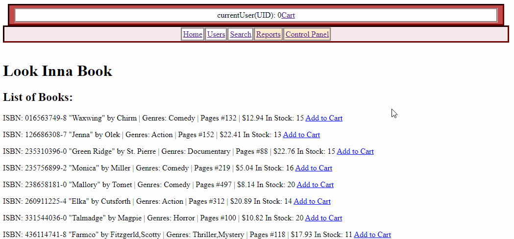

# bookstore-comp3005final
COMP 3005 Project (Fall 2022) ; Instructor: Ahmed El-Roby and Abdelghny Orogat

1. Install PostgreSQL 15.1 for Windows {https://www.enterprisedb.com/downloads/postgres-postgresql-downloads}
2. Go to node-api-postgres dir
3. install Node.js through google
4. {npm init -y}
5. Install Express for server, node-postgres for connection, pug for web display {npm i express pg pug}
6. Select PostgreSQL server then PGADMIN Object -> Create -> Database -> Database:"bookstore"
7. Check properties of server group "postgresql14"

UPDATE queries.js with it.
Note: Password may have to be pgadmin server password

const Pool = require('pg').Pool
const pool = new Pool({
  user: 'postgres',
  host: 'localhost',
  database: 'bookstore',
  password: 'password',
  port: 5432,
})

Now you have to make a table, and entries for test.

8. Navigate to ./code directory (within node-api-postgres) & start server with {node index.js}

TIP: If there is a freeze in the console (powershell), go to properties -> Edit Options -> Uncheck Quick Edit Mode

