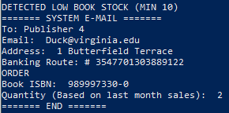

<h2> # bookstore-comp3005final </h2>

<h3>

Members | Github
------------ | -------------
Kaushik Paul | https://github.com/Kxushik
Spencer Low | https://github.com/spencerlow

</h3>

<i> COMP 3005 Project (Fall 2022) ; Instructor: Ahmed El-Roby and Abdelghny Orogat </i>

---
1. Install PostgreSQL 15.1 for Windows {https://www.enterprisedb.com/downloads/postgres-postgresql-downloads}
2. Go to node-api-postgres dir
3. install Node.js through google
4. {npm init -y}
5. Install Express for server, node-postgres for connection, pug for web display {npm i express pg pug}
6. Select PostgreSQL server then PGADMIN Object -> Create -> Database -> Database:"bookstore"
7. Check properties of server group "postgresql14"
---

**UPDATE queries.js with it.**
<br>
`Note: Password may have to be pgadmin server password`
```ruby
const Pool = require('pg').Pool
const pool = new Pool({
  user: 'postgres',
  host: 'localhost',
  database: 'bookstore',
  password: 'password',
  port: 5432,
})
```
Now you have to make a table, and entries for test.

8. Navigate to ./code directory (within node-api-postgres) & start server with {node index.js}


**TIP: If there is a freeze in the console (powershell), go to properties -> Edit Options -> Uncheck Quick Edit Mode**

---



<br><br><br><br><br><br><br><br><br><br><br><br>
---
<h2> Relational schema</h2>

<h2> Database schema</h2>

